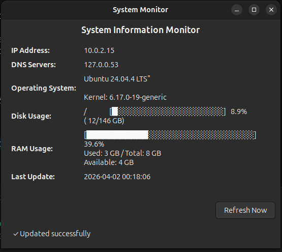

## Installation

### Debian/Ubuntu and derivatives

```bash
# Download the package
wget https://github.com/AndreyJVM/system-monitor/releases/download/v{VERSION}/system-monitor_{VERSION}_all.deb

# Install
sudo dpkg -i system-monitor_{VERSION}_all.deb

# Install dependencies if needed
sudo apt-get install -f
```
---




```shell
make release-patch
```